# KN03: IaaS - Virtuelle Server

## Lernziele
- Sie machen die ersten Schritte mit IAAS.
- Eigene manuelle Installation einer virtuellen Instanz. Sie können Services auf einer virtuellen Instanz installieren und Dateien aus einem Git-Repo herunterladen und verwenden.
- Sie lernen wie Sie eine Sicherheitsgruppe (Firewall) erstellen, resp. verändern.
----

## A) Installation von Web- und Datenbankserver (60%)

**sudo apt update:**
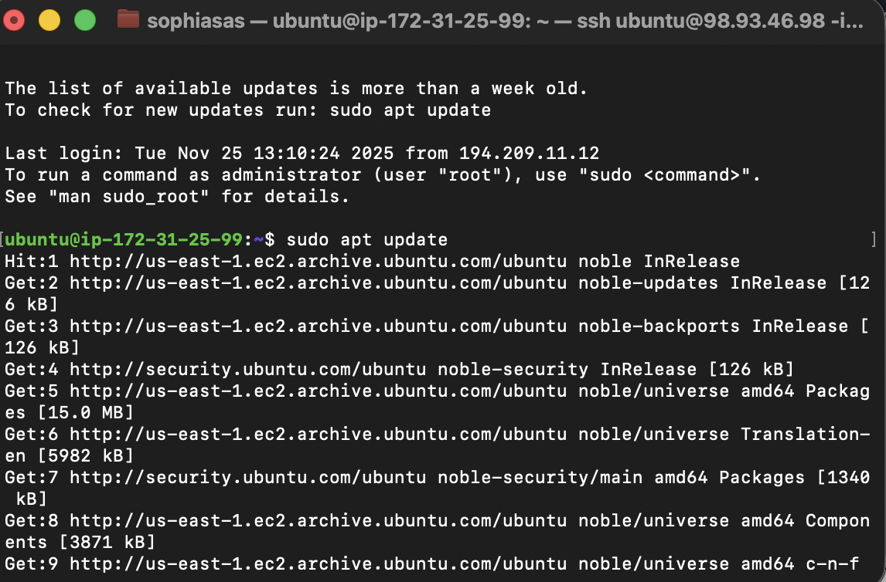

**sudo apt install apache2:**
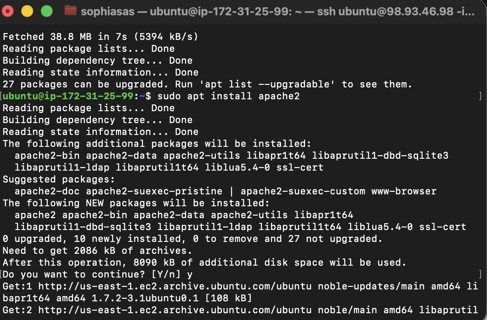

**sudo apt install php:**
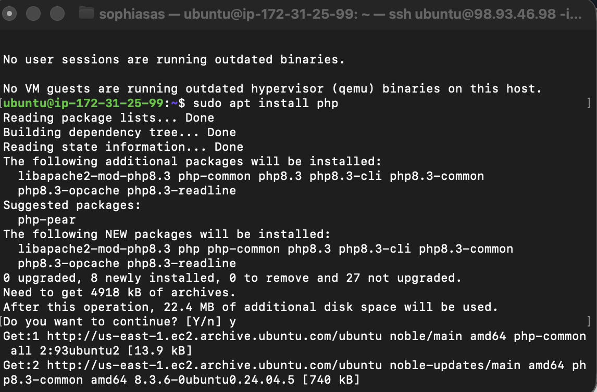

**sudo apt install libapache2-mod-php:**
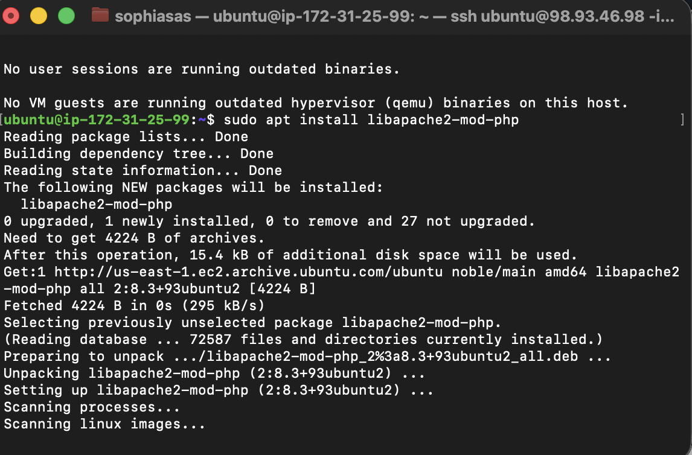

**sudo apt install mariadb-server:**
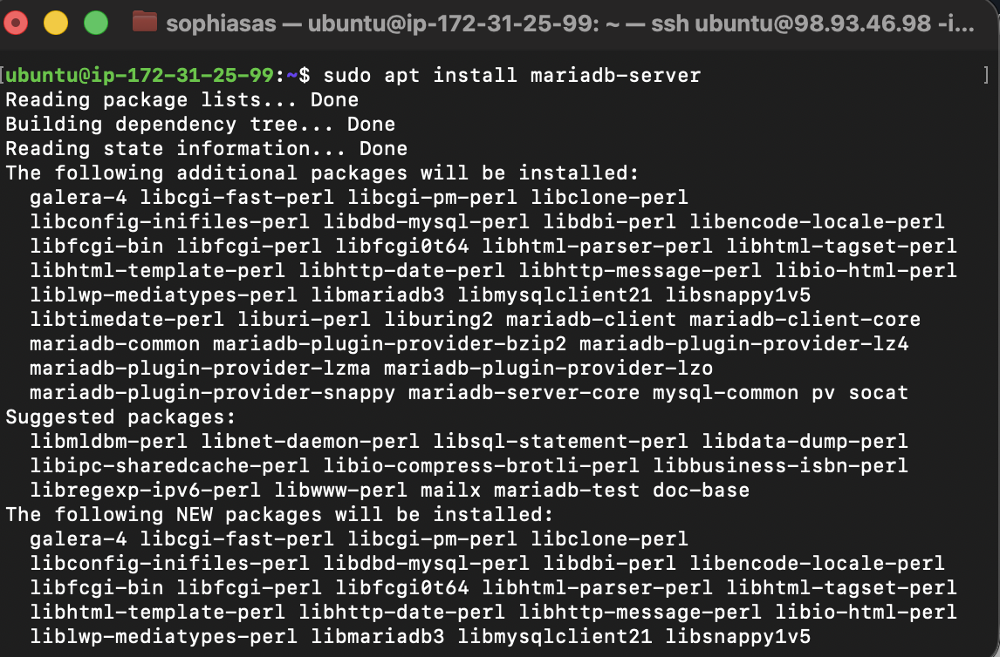

**sudo apt install php-mysql:**
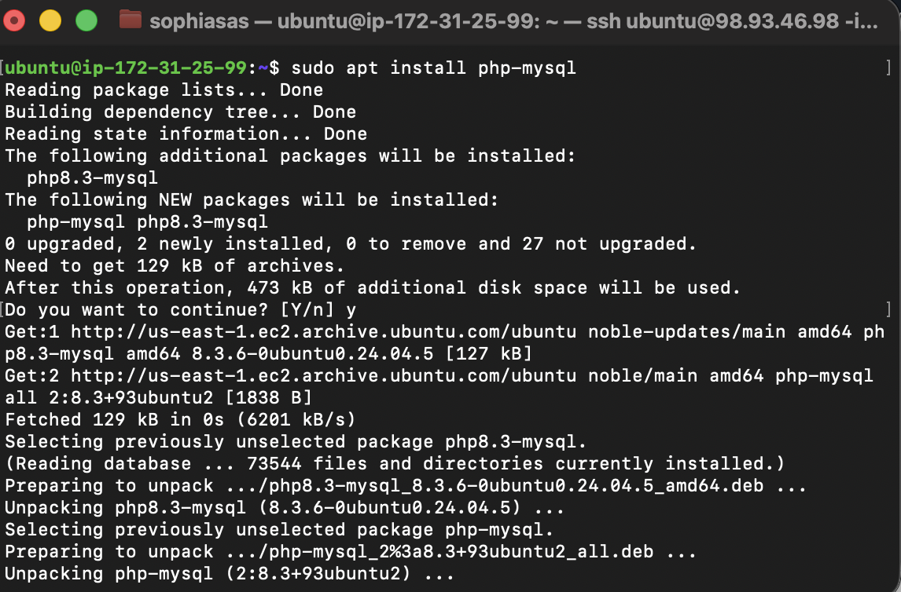

**sudo mysql -u root -e "GRANT ALL ON *.* TO 'admin'@'%' IDENTIFIED BY 'Ihr-Passwort' WITH GRANT OPTION;":**
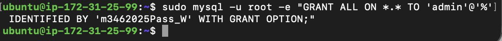

**sudo systemctl restart mariadb.service & sudo systemctl restart apache2:**
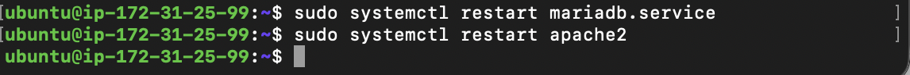

**git clone https://gitlab.com/ch-tbz-it/Stud/m346/m346scripts.git:**
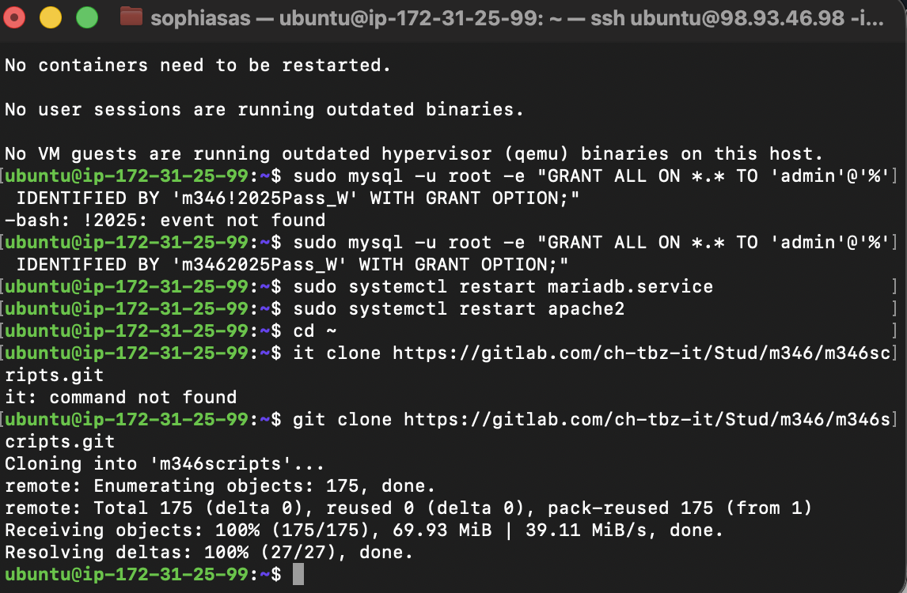

 

### Seiten

info.php:
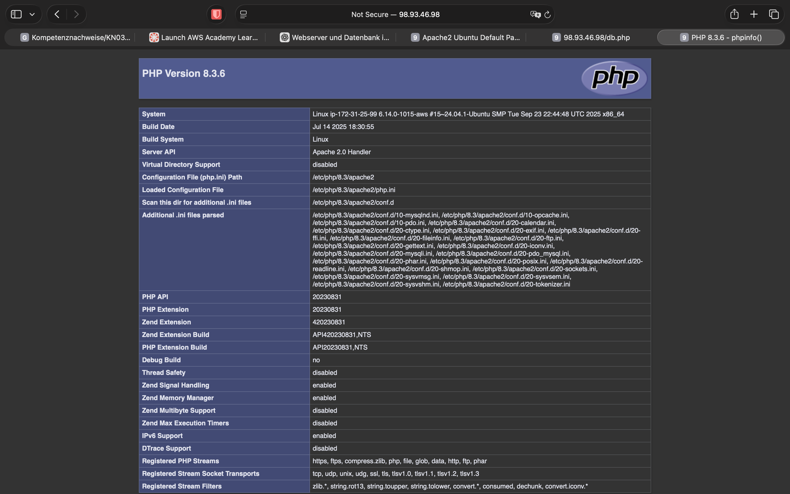

db.php:

index.html:
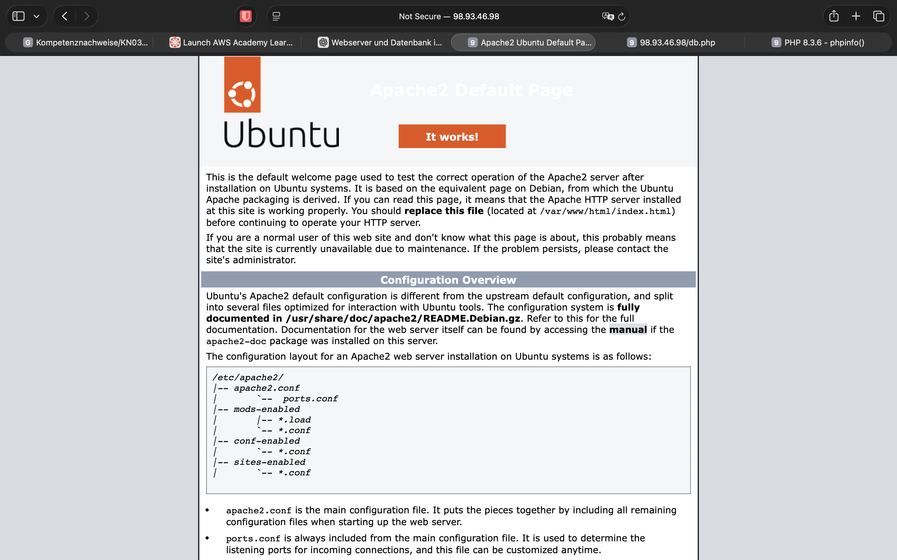

 

### Öffentliche Ip

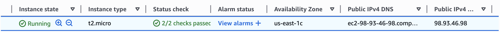

 

### Regeln der Sicherheitsgruppe

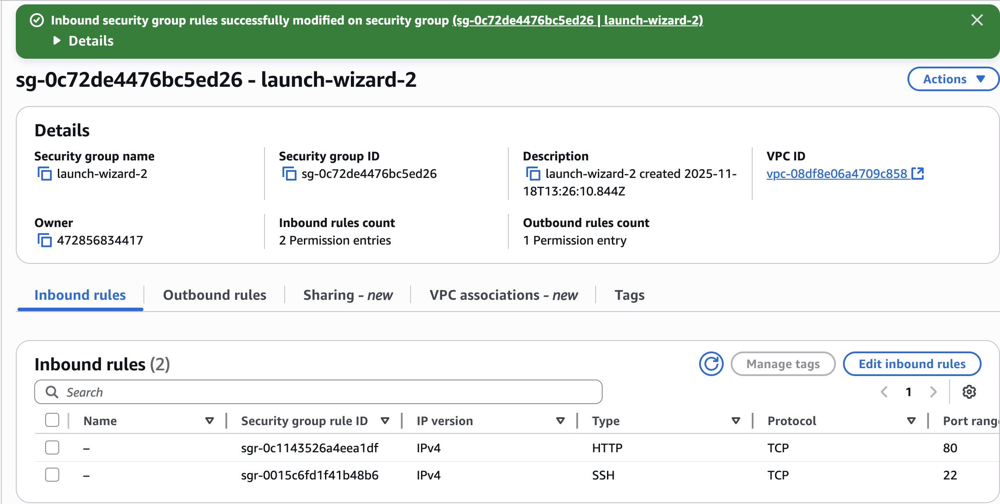

 

### Screenshot der Mysql Konsole Befehls
Es zeigt alle Grants des Admin User's an (bw, der Command der wir in der Konsole geschrieben haben):
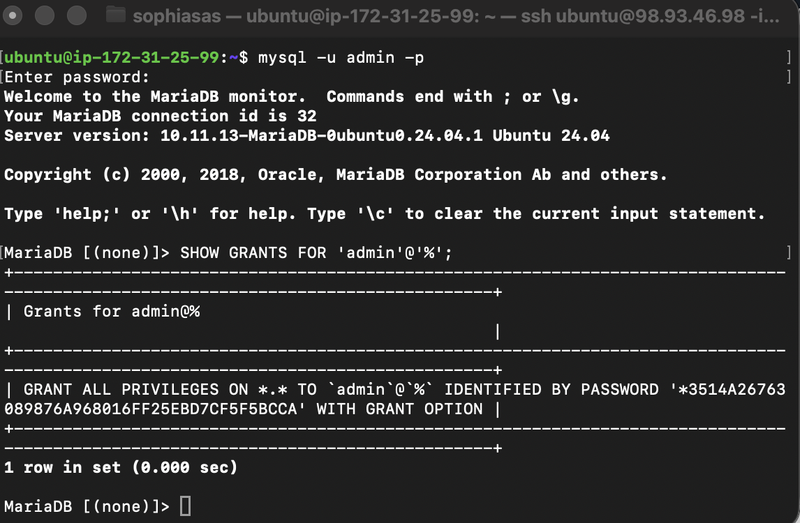

----
