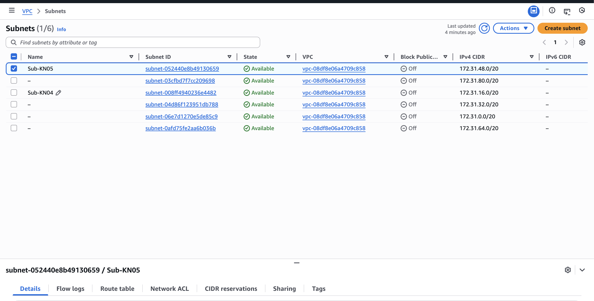

# KN05: Netzwerk / Sicherheit

## Lernziele

- Sie setzen sich vertieft mit dem Netzwerk von public Cloud Anbieter auseinander.
- Sie verstehen was eine VPC ist und Sie verstehen was ein Subnetz ist.
- Sie verstehen die verschiedenen Netzwerk-Komponenten, die eine virtuelle Instanz benötigt, speziell Sicherheitsgruppe, Netzwerkinterface, (statische) öffentliche IP, private IP
- Sie werden zwei virtuelle Instanzen erstellen und das Zusammenspiel der Netzwerk-Komponenten testen.
----

### A) Grundbegriffe und private IP wählen (30%)

#### VPC (Virtual Private Cloud)
Eine VPC ist ein virtuelles, logisch isoliertes Netzwerk innerhalb von AWS. Sie definiert den gesamten IP-Adressbereich, in dem Ressourcen wie virtuelle Server betrieben werden. Innerhalb der VPC kann das Netzwerk frei strukturiert und abgesichert werden.

#### Subnetz (Subnet)
Ein Subnetz ist ein Teilbereich des IP-Adressraums einer VPC. Subnetze dienen dazu, Ressourcen logisch zu trennen, zum Beispiel Webserver und Datenbanken, und sind jeweils einer Availability Zone zugeordnet.

#### Public IP (öffentliche IP)
Eine Public IP ist eine IP-Adresse, mit der eine Instanz direkt aus dem Internet erreichbar ist. Diese IP-Adresse kann sich ändern, wenn die Instanz gestoppt und neu gestartet wird.

#### Private IP
Eine Private IP ist eine interne IP-Adresse innerhalb der VPC. Sie wird für die Kommunikation zwischen Ressourcen im gleichen Netzwerk verwendet und ist nicht direkt aus dem Internet erreichbar.

#### Static IP (statische IP / Elastic IP)
Eine statische IP ist eine feste, öffentliche IP-Adresse, die sich nicht ändert. In AWS wird diese als Elastic IP bezeichnet und kann dauerhaft einer Instanz zugewiesen werden, damit sie immer unter derselben Adresse erreichbar ist.

### Private IP's
DB: 172.31.50.10

Web: 172.31.55.10

### IMG Subnets

----

### B) Objekte und Instanzen erstellen (70%)

----
