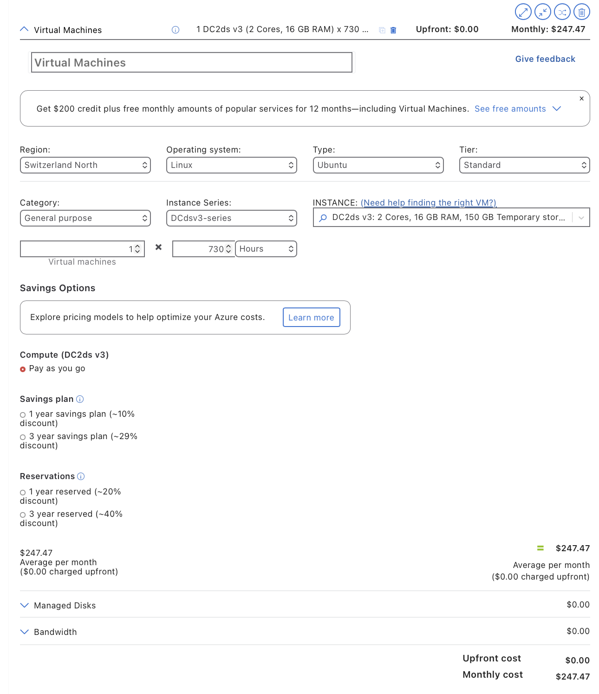
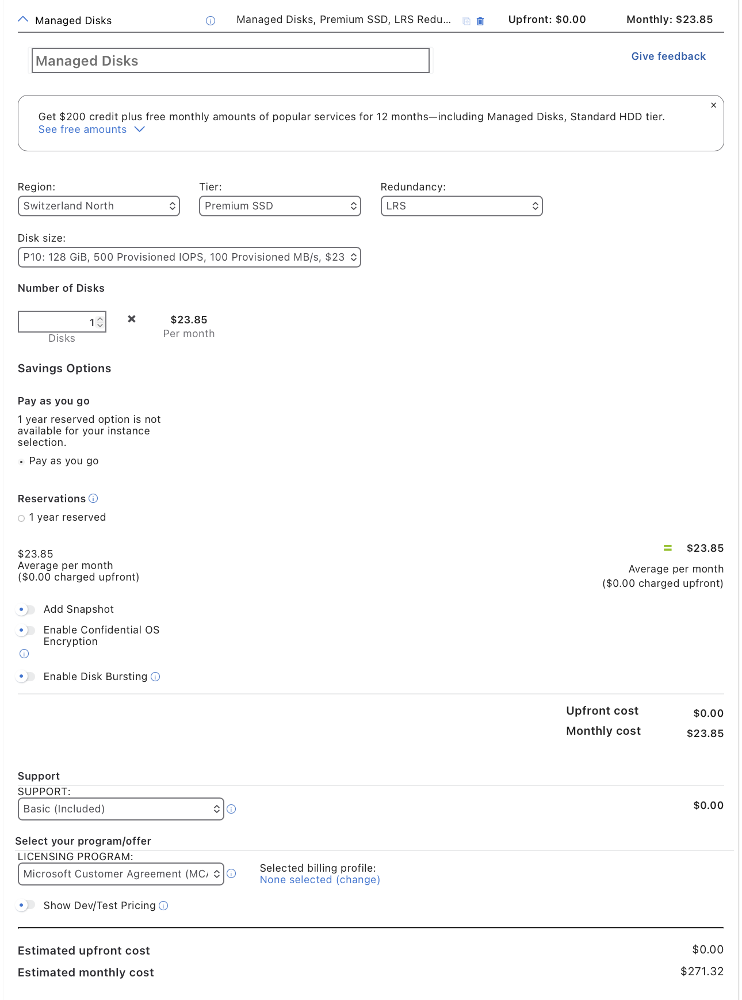
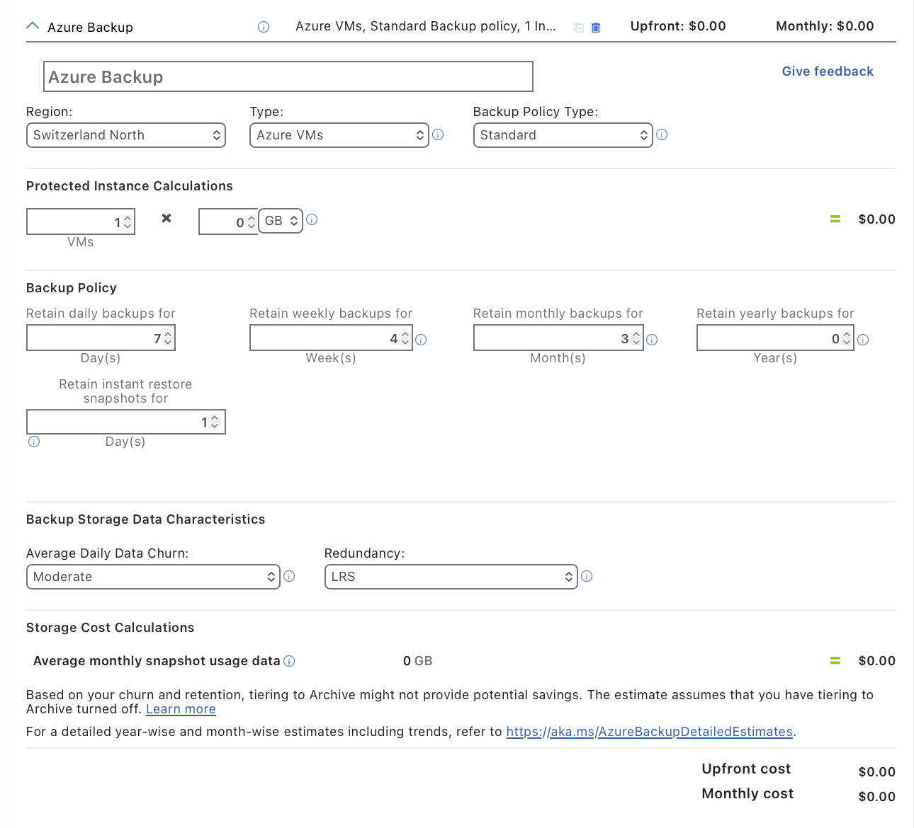
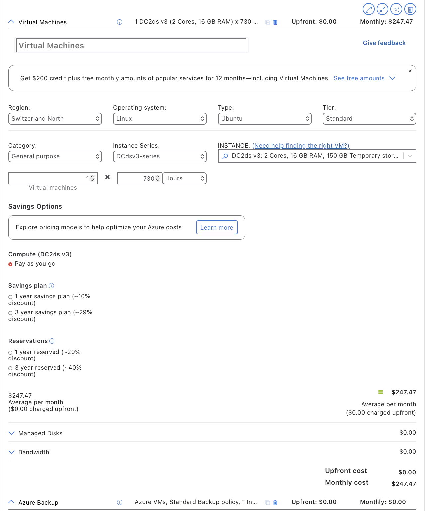
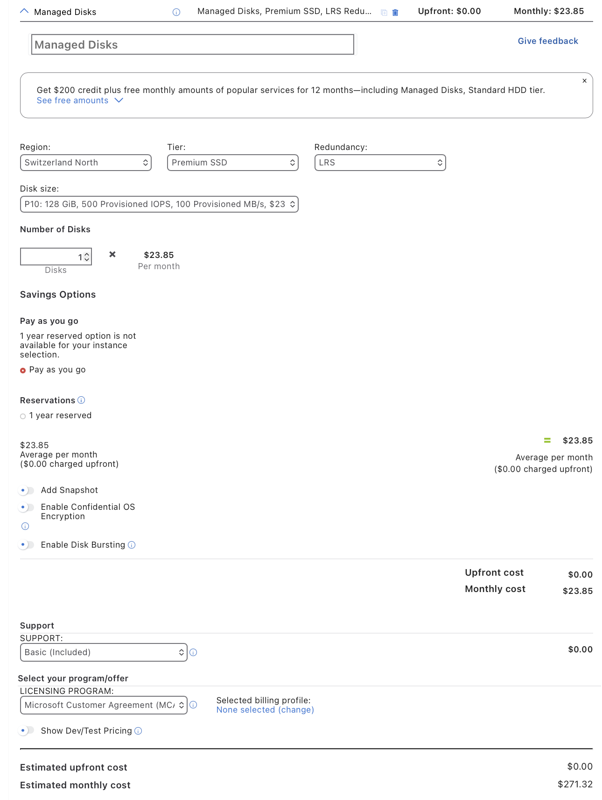
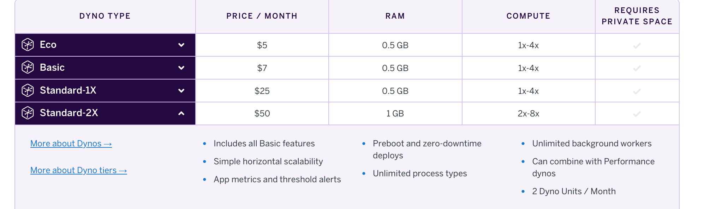
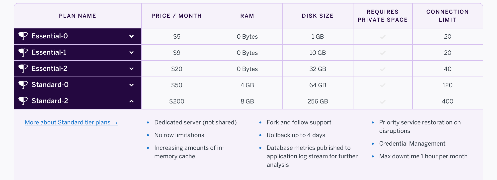
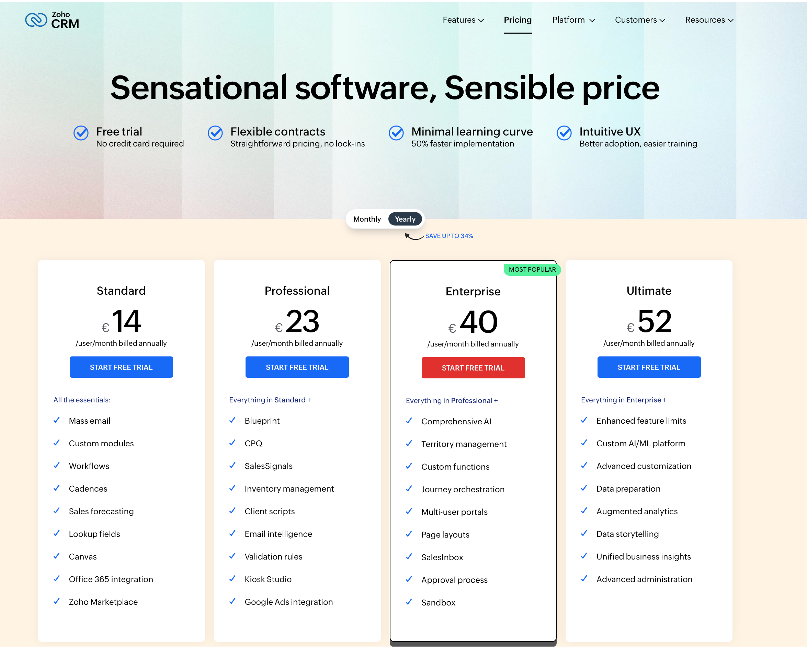
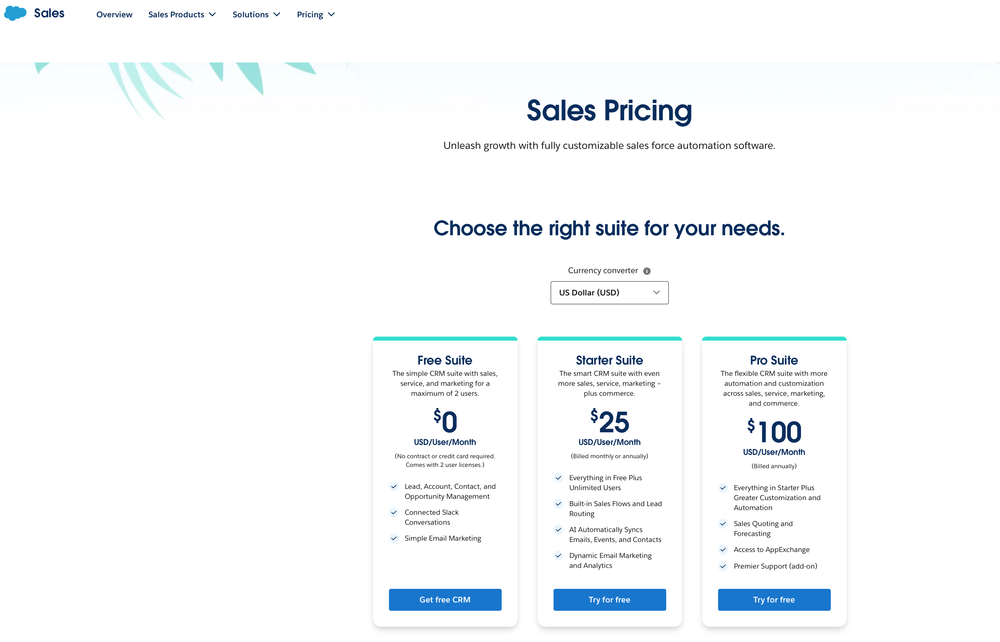

# KN10: Kostenberechnung

## Lernziele
- Sie lernen verschiedene Kostenrechner kennen und erstellen und vergleichen die Kosten von mehreren Providern.
- Sie verstehen was die Möglichkeiten und Limitierungen der Migrationsmodelle sind.
----

### A) Kostenrechnung IAAS - Rehosting (60%)
### AWS
#### Webserver
On-Premise: 1 Core, 2 GB RAM, 20 GB Speicher

AWS Auswahl:
Instance Type: t3.small
- 2 vCPU
- 2 GB RAM
  
Betriebssystem: Linux (Ubuntu)

Nutzung: On-Demand

Laufzeit: 730 Stunden / Monat

Storage:
20 GB EBS (gp3)

#### Database
On-Premise: 2 Cores, 4 GB RAM, 100 GB Speicher

AWS Auswahl:
Instance Type: t3.medium
- 2 vCPU
- 4 GB RAM
 
OS: Linux

Storage:
100 GB EBS (gp3)

### Kosten für AWS

### Erklärung der Benutzung dieser Komponenten
Für das Rehosting auf AWS wurde Amazon EC2 verwendet. Der Webserver wird als EC2-Instanz vom Typ t3.small betrieben, da diese Instanz mit 2 vCPU und 2 GB RAM der bestehenden On-Premise-Infrastruktur am nächsten kommt. Der Datenbankserver nutzt eine t3.medium-Instanz mit 2 vCPU und 4 GB RAM. Als Betriebssystem wurde Linux (Ubuntu) gewählt, um zusätzliche Lizenzkosten zu vermeiden. Der Speicher wird über EBS General Purpose SSDs bereitgestellt. Backups werden mittels EBS Snapshots realisiert.

### Azure
### Azure Erklärung zur Auswahl der Komponenten
#### Webserver:
- On-Premise: 1 Core, 2 GB RAM, 20 GB Speicher
- Azure: B1ms VM, 1 vCPU, 2 GB RAM, S4 SSD 32 GB
- Abweichung: Disk minimal größer (32 GB statt 20 GB) → nötig wegen Azure-Standardgrößen
- Backup: tägliche/wöchentliche/monatliche Retention, LRS

#### Datenbankserver:
- On-Premise: 2 Cores, 4 GB RAM, 100 GB Speicher
- Azure: DC2ds v3 VM, 2 vCPU, 16 GB RAM, S10 SSD 128 GB
- Abweichung: Mehr RAM und größere Disk für stabile DB-Performance
- Backup: gleiche Retention, LRS

#### Azure Kosten & Info in den Excel Files

#### Begründung:
- Komponenten möglichst nah an On-Premise angepasst
- Kleine Anpassungen (RAM/Disk) für Performance, Stabilität und Azure-Standards
- Backup-Retention identisch übernommen für Datensicherheit

----

### B) Kostenrechnung PAAS - Replattforming (20%)

### Web-Applikation (Heroku Dyno)
#### Gewählte Komponente:
Heroku Dyno Standard-2X – 50 USD / Monat

Der Standard-2X Dyno bietet 1 GB RAM und erhöhte Rechenleistung und eignet sich für den produktiven Betrieb einer CRM-Applikation mit ca. 30 Benutzern.
Im Vergleich zum bisherigen On-Premise Webserver (1 Core, 2 GB RAM) entfällt die Server- und Betriebssystemverwaltung vollständig. Die geringere RAM-Menge wird durch die gemanagte Plattform und die Möglichkeit zur Skalierung ausgeglichen.

#### Backups
Backups sind bei Heroku Postgres bereits integriert (tägliche automatische Backups und Wiederherstellungsmöglichkeiten). Ein separates Backup-System ist nicht mehr notwendig.

### Datenbank (Heroku Postgres)
#### Gewählte Komponente:
Heroku Postgres Standard-0 – 200 USD / Monat

Dieser Plan bietet ca. 4 GB RAM und 64 GB Speicher und ist vergleichbar mit dem bisherigen Datenbankserver. Wartung, Updates und Hochverfügbarkeit werden von Heroku übernommen. Der Speicher kann bei Bedarf jederzeit erweitert werden.

----

### C) Kostenrechnung SAAS - Repurchasing (10%)
#### Zoho CRM
##### Verwendetes Pricing:
Zoho CRM – Professional Plan
##### Begründung:
Der Professional-Plan bietet alle wichtigen CRM-Funktionen wie Lead- und Kontaktmanagement, Automatisierungen sowie Berichte. Er ist für ein Unternehmen mit rund 30 Benutzern gut geeignet und bietet ein sehr gutes Preis-Leistungs-Verhältnis. Für kleinere und mittlere Firmen ist dieser Plan ausreichend, ohne unnötige Zusatzfunktionen.

#### Salesforce Sales Cloud
##### Verwendetes Pricing:
Salesforce Sales Cloud – Professional Plan
##### Begründung:
Der Professional-Plan stellt im Vergleich zu günstigeren Salesforce-Plänen einen funktionsreichen Einstieg dar und bietet erweiterte Vertriebs- und Automatisierungsfunktionen. Höhere Editionen (Enterprise/Unlimited) wären für die Firmengröße überdimensioniert und deutlich teurer.

#### Auswahl / Empfehlung
Ausgewählter Anbieter: Zoho CRM
##### Begründung:
Zoho CRM bietet für ähnliche Kernfunktionen deutlich geringere Kosten pro Benutzer als Salesforce. Für eine Firma mit 30 Nutzern ist Zoho CRM wirtschaftlicher und einfacher zu betreiben, während Salesforce vor allem für sehr große oder komplexe Organisationen Vorteile bietet.

----

### D) Interpretation der Resultate (10%)
Alle 5 Varianten unterscheiden sich deutlich an ihren Kosten, da sie unterschiedliche Service Modelle(laaS,PaaS,SaaS) abdecken.

#### laas(AWS & Azure)
Folgende Zusatzkosten entstehen beispielweise durch:
- Adminstrationsaufwand (Systemspflege,Updates,Security)
- Monitoring und Logging
- Datenverkehr
- Langfristige Backup-Speicherungen
- Notwendige Spezialkentnisse oder externe Dienstleister

Aber die Kosten zwischen AWS und Azure unterscheiden sich:
- Azure verwendet grössere Standart-VM-Grössen
- Azure bei der Datenbank mehr RAM bereitstellt
- Preisstruktur,Backup-Modelle und Storage Grössen sind unterschiedlich

#### PaaS (Heroku)
Keroku ist teurer als reines lassS, weil:

- Betriebssystem, Patches, Skalierung und Backups inklusive sind
- Hochverfügbarkeit und Wartung durch den Anbieter erfolgen

Folgende Zusatzkosten enstehen beispielweise durch:

- Reduzierter Administrationsaufwand
- Weniger Ausfallrisiken
- Schellere Bereitstellung

Manchmal zeigt man nur die höheren Kosten, für mehr Kunden, aber sie werden meistens versteckt angezeigt.

#### Zoho CRM / Salesforce SaaS
Der Aufwand ist gering:
- Datenmigration
- Benutzer-Schulung
- Anpassung der Geschäftsprozesse an das neue System

Kein Aufwand für:
- Server
- Updates
- Backups
- Skalierung
Vorteil: Minimaler technischer Aufwand
Nachteil: Abhängigkeit vom Anbieter, geringere Individualisierung

#### Gesamteinschätzung
IaaS ist kostengünstig in der Infrastruktur, aber teuer im Betrieb und Know-how.

PaaS liegt kostenmäßig in der Mitte und reduziert den technischen Aufwand deutlich.

SaaS ist am teuersten pro Benutzer, bietet aber den geringsten internen Aufwand.

Für die Firma ist Zoho CRM die wirtschaftlichste Lösung, da sie die geringsten Betriebsaufwände verursacht und ausreichend Funktionalität für 30 Benutzer bietet.

Heroku stellt einen guten Kompromiss dar, falls die bestehende CRM-Applikation beibehalten werden soll.
