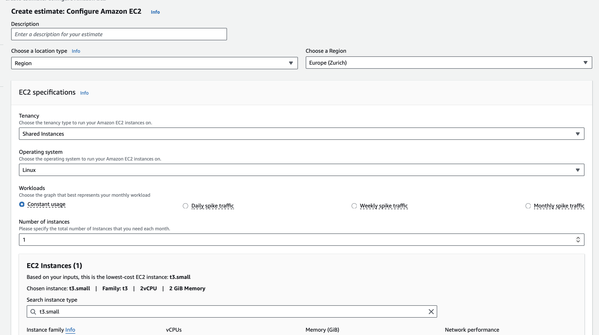
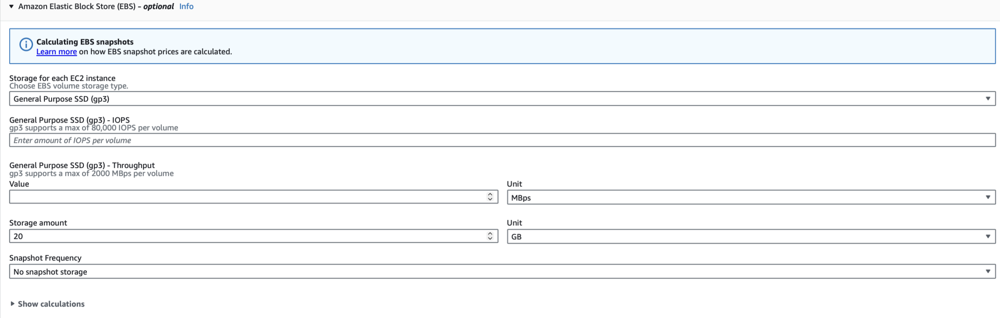
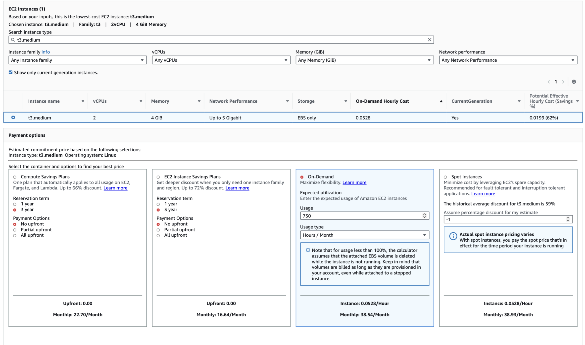
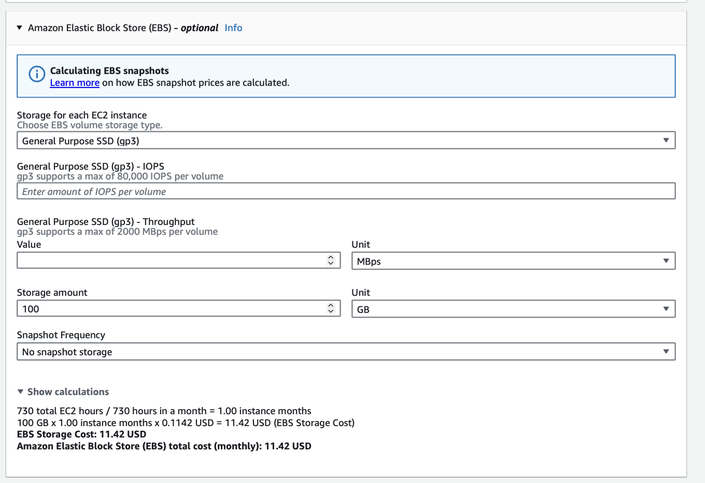

# KN10: Kostenberechnung

## Lernziele
- Sie lernen verschiedene Kostenrechner kennen und erstellen und vergleichen die Kosten von mehreren Providern.
- Sie verstehen was die Möglichkeiten und Limitierungen der Migrationsmodelle sind.
----

### A) Kostenrechnung IAAS - Rehosting (60%)
### AWS Werte
#### Webserver
On-Premise: 1 Core, 2 GB RAM, 20 GB Speicher

AWS Auswahl:
Instance Type: t3.small
- 2 vCPU
- 2 GB RAM
  
Betriebssystem: Linux (Ubuntu)

Nutzung: On-Demand

Laufzeit: 730 Stunden / Monat

Storage:
20 GB EBS (gp3)

#### Database
On-Premise: 2 Cores, 4 GB RAM, 100 GB Speicher

AWS Auswahl:
Instance Type: t3.medium
- 2 vCPU
- 4 GB RAM
 
OS: Linux

Storage:
100 GB EBS (gp3)

### Kosten für AWS

### Erklärung der Benutzung dieser Komponenten
Für das Rehosting auf AWS wurde Amazon EC2 verwendet. Der Webserver wird als EC2-Instanz vom Typ t3.small betrieben, da diese Instanz mit 2 vCPU und 2 GB RAM der bestehenden On-Premise-Infrastruktur am nächsten kommt. Der Datenbankserver nutzt eine t3.medium-Instanz mit 2 vCPU und 4 GB RAM. Als Betriebssystem wurde Linux (Ubuntu) gewählt, um zusätzliche Lizenzkosten zu vermeiden. Der Speicher wird über EBS General Purpose SSDs bereitgestellt. Backups werden mittels EBS Snapshots realisiert.

----
#### Azure Kosten & Info in den Excel Files
### Azure Erklärung zur Auswahl der Komponenten
#### Webserver:
- On-Premise: 1 Core, 2 GB RAM, 20 GB Speicher
- Azure: B1ms VM, 1 vCPU, 2 GB RAM, S4 SSD 32 GB
- Abweichung: Disk minimal größer (32 GB statt 20 GB) → nötig wegen Azure-Standardgrößen
- Backup: tägliche/wöchentliche/monatliche Retention, LRS

#### Datenbankserver:
- On-Premise: 2 Cores, 4 GB RAM, 100 GB Speicher
- Azure: DC2ds v3 VM, 2 vCPU, 16 GB RAM, S10 SSD 128 GB
- Abweichung: Mehr RAM und größere Disk für stabile DB-Performance
- Backup: gleiche Retention, LRS
#### Begründung:
- Komponenten möglichst nah an On-Premise angepasst
- Kleine Anpassungen (RAM/Disk) für Performance, Stabilität und Azure-Standards
- Backup-Retention identisch übernommen für Datensicherheit

----

### B) Kostenrechnung PAAS - Replattforming (20%)
BlaBla

----

### C) Kostenrechnung SAAS - Repurchasing (10%)
BlaBla

----

### D) Interpretation der Resultate (10%)
BlaBla
